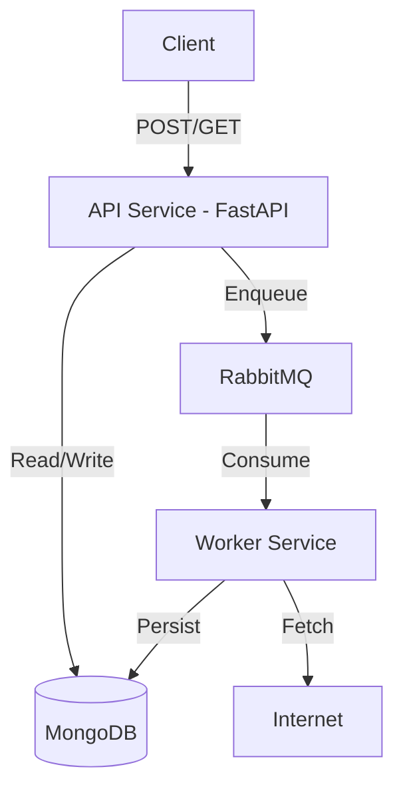

This is a comprehensive and well-structured README. To make it "GitHub-ready," I have refactored it to improve visual hierarchy, added a **Quick Start** section for immediate developer engagement, and polished the technical tables for better scannability.

---

# 🌐 HTTP Inventory

**HTTP Inventory** is a high-performance, asynchronous metadata ingestion system. It accepts URLs, fetches comprehensive HTTP metadata (headers, cookies, page source, status code, final URL), and persists the results to a resilient database.

### 🚀 Key Features

* **Decoupled Architecture:** Fast ingestion via API, heavy lifting via background workers.
* **Reliability:** At-least-once delivery using RabbitMQ persistent queues and publisher confirms.
* **Resilience:** Exponential backoff for Database and Broker reconnections.
* **Clean Architecture:** Strict separation of Domain logic and Infrastructure (Ports & Adapters).
* **Smart Retrieval:** `GET` requests implement a read-through pattern (auto-enqueue on cache miss).

---

## 🏗️ System Architecture

The system is composed of two primary Python services and two infrastructure components.



| Component | Responsibility |
| --- | --- |
| **API Service** | Validates URLs, manages the "read-through" logic, and exposes health probes. |
| **Worker Service** | Handles the async fetch-retry loop, page source truncation, and status updates. |
| **RabbitMQ** | Durable message broker ensuring tasks are not lost during restarts. |
| **MongoDB** | Document store for metadata, indexed by URL for  retrieval. |

---

## 🚦 Getting Started

### Prerequisites

* [Docker Desktop](https://www.docker.com/products/docker-desktop/)
* [Docker Compose](https://docs.docker.com/compose/)

### Quick Start

1. **Clone and Configure**
```bash
git clone https://github.com/your-repo/http-inventory.git
cd http-inventory
cp .env.example .env

```


2. **Launch Services**
```bash
docker compose up --build

```


3. **Verify**
* **API (Swagger UI):** [http://localhost:6577/docs](http://localhost:6577/docs) — interactive docs; use "Try it out" to send requests.
* **API (ReDoc):** [http://localhost:6577/redoc](http://localhost:6577/redoc) — readable reference.
* **OpenAPI JSON:** [http://localhost:6577/openapi.json](http://localhost:6577/openapi.json)
* **RabbitMQ UI:** `http://localhost:15672` (guest/guest)


---

## 🛠️ API Reference

### 1. Ingest Metadata

`POST /metadata`

```json
{ "url": "https://google.com" }

```

* **Response:** `202 Accepted`
* **Logic:** Enqueues the URL for processing.

### 2. Retrieve Metadata

`GET /metadata?url=https://google.com`

* **Response 200:** Returns full metadata (if `COMPLETED` or `FAILED_PERMANENT`).
* **Response 202:** Returns `{ "status": "IN_PROGRESS" }`. If the record didn't exist, it is enqueued automatically.

### 🔄 Status Lifecycle

The system moves documents through a strictly deterministic state machine:
`PENDING` → `IN_PROGRESS` → `COMPLETED` | `FAILED_RETRYABLE` → `FAILED_PERMANENT`

---

## ⚙️ Configuration

The system is highly configurable via `.env`. Key variables include:

| Variable | Default | Description |
| --- | --- | --- |
| `MAX_RETRIES` | `3` | Number of attempts for transient errors (5xx/Timeouts). |
| `QUEUE_MAX_LENGTH` | `1000` | Backpressure limit before API rejects requests. |
| `MAX_PAGE_SOURCE_LENGTH` | `1,000,000` | Truncation limit for large HTML responses. |
| `PREFETCH_COUNT` | `1` | Ensures worker stability by processing one task at a time. |

---

## 🧩 Engineering Principles

### Clean Architecture

We follow the **Ports and Adapters** pattern. The **Domain** layer contains zero infrastructure imports.

* **API Composition Root:** `api/app/composition.py`
* **Worker Composition Root:** `worker/app/composition.py`

### Failure Handling

* **Retryable Failures:** `MetadataFetchError` and `TimeoutError` trigger a `nack` with `requeue=True`.
* **Permanent Failures:** Exhausted retries or 4xx errors mark the record as `FAILED_PERMANENT` and `ack` the message to clear the queue.
* **Connectivity:** Both services implement an async reconnection loop with exponential backoff if the Broker or DB goes down.

---

## 💡 Future Roadmap

* [ ] **Cache Layer:** Integrate Redis to offload MongoDB read pressure.
* [ ] **Dead Letter Queue (DLQ):** Preserve permanently failed messages for manual inspection.
* [ ] **Observability:** Implement OpenTelemetry for distributed tracing across API and Worker.
* [ ] **Horizontal Scaling:** Optimize shared state to support multiple parallel workers.

---

[![Architecture Diagram](https://mermaid.ink/img/pako:eNqlVe9vm0gQ_VdW-8mRiEtw_As1PlGb5KzGjmtTtXeyZK1hglFg11l2q-as_O83GDA0jtvmjg_IeN7MvHk7D3bUFwFQm6bwqIH7MIpYKFmy5AQvppXgOlmDzJ_zuwRfERmuG9alaRDrsoe3dvssD06FAiK-gSTDOAKuDDJn63WkJp9sMrtbeORdAooFTDHSGPMQUhUJXuTmGeeDgTMbH6F3WsbPOQ7DCKrV1es4Sjd7iIH0cJJUraKggJfA87LyUPD7SCbEGX6sCmIw728Ty7SI4_uwVRCQXaqY0qlNPn12P7ujoibwYMmP5Gjvlchu5kk5JoKHYvTBJjfuD2IsEiYVmYOSEXxj8auS_JDyB0571Ww265ociqME8qmBiLP6ybE46-ALGWTEyLXQPCCNIfM3QCZRmhbg7CoqHTSb6jiuom88gf-ocZxCSbegOuYKZAJBxFDWxT6pxrkSG5vVlF4U1WfudDSe3hhkPF3N5nc3c3exMIiQ5NoZ37qj1dz15n85H27d0zKMhK8THOCNc9Uanh7Ow9EizuK3Dza8m8xuXc8d1YaZufOJM3Wn3v8axiR3H8muXLl3IKWQdQuc9EJhg-z9cOyFcnFqo3wR8gEjDSd94j6ZSeFDmkY8PHvh4cEgRyJ7iKOs2ASBLIQclwdrKMd_1JEEsj1UXMXCf3iBPtAAnmoJK5kfTENvU0BXFotz9iLLYzIERRaRApv86Xkzcg3K37x03EL7WetK5eO26P2HlS-SbQy4N68gK6uxknyxQUo-sXUMxM2OpsrMGjOlINmqlLwnE-drFfsJB1nWO4GueHAk0tg7XcOVJzXU9nVP7dB9cPXb7bdoAcZx91b3LIrxJH5J4yDH8Uq-ug9ziIEhu2oJEEsNGsoooLbCOQyaZCyyR7rLIEuqNpDAktr4M4B7pmO1pEv-jGlbxv8WIikzpdDhhtr3DAUwqN6iacov6uFfiQ1BDtHzitqdVm9fhNo7-p3aVqvV7LRa_W7X7Flmt9036BO1zzvdZrff7rZN69LqdzoXF88G_Wff1mqal71er981LxDe6vRbBsXXoxJykn_X95_3538BztNs-w?type=png)](https://mermaid.live/edit#pako:eNqlVe9vm0gQ_VdW-8mRiEtw_As1PlGb5KzGjmtTtXeyZK1hglFg11l2q-as_O83GDA0jtvmjg_IeN7MvHk7D3bUFwFQm6bwqIH7MIpYKFmy5AQvppXgOlmDzJ_zuwRfERmuG9alaRDrsoe3dvssD06FAiK-gSTDOAKuDDJn63WkJp9sMrtbeORdAooFTDHSGPMQUhUJXuTmGeeDgTMbH6F3WsbPOQ7DCKrV1es4Sjd7iIH0cJJUraKggJfA87LyUPD7SCbEGX6sCmIw728Ty7SI4_uwVRCQXaqY0qlNPn12P7ujoibwYMmP5Gjvlchu5kk5JoKHYvTBJjfuD2IsEiYVmYOSEXxj8auS_JDyB0571Ww265ociqME8qmBiLP6ybE46-ALGWTEyLXQPCCNIfM3QCZRmhbg7CoqHTSb6jiuom88gf-ocZxCSbegOuYKZAJBxFDWxT6pxrkSG5vVlF4U1WfudDSe3hhkPF3N5nc3c3exMIiQ5NoZ37qj1dz15n85H27d0zKMhK8THOCNc9Uanh7Ow9EizuK3Dza8m8xuXc8d1YaZufOJM3Wn3v8axiR3H8muXLl3IKWQdQuc9EJhg-z9cOyFcnFqo3wR8gEjDSd94j6ZSeFDmkY8PHvh4cEgRyJ7iKOs2ASBLIQclwdrKMd_1JEEsj1UXMXCf3iBPtAAnmoJK5kfTENvU0BXFotz9iLLYzIERRaRApv86Xkzcg3K37x03EL7WetK5eO26P2HlS-SbQy4N68gK6uxknyxQUo-sXUMxM2OpsrMGjOlINmqlLwnE-drFfsJB1nWO4GueHAk0tg7XcOVJzXU9nVP7dB9cPXb7bdoAcZx91b3LIrxJH5J4yDH8Uq-ug9ziIEhu2oJEEsNGsoooLbCOQyaZCyyR7rLIEuqNpDAktr4M4B7pmO1pEv-jGlbxv8WIikzpdDhhtr3DAUwqN6iacov6uFfiQ1BDtHzitqdVm9fhNo7-p3aVqvV7LRa_W7X7Flmt9036BO1zzvdZrff7rZN69LqdzoXF88G_Wff1mqal71er981LxDe6vRbBsXXoxJykn_X95_3538BztNs-w)

**Next Step:** See [High-Level Design (HLD)](documents/hld.md) and [Low-Level Design (LLD)](documents/lld.md) for a deeper dive into the codebase.
