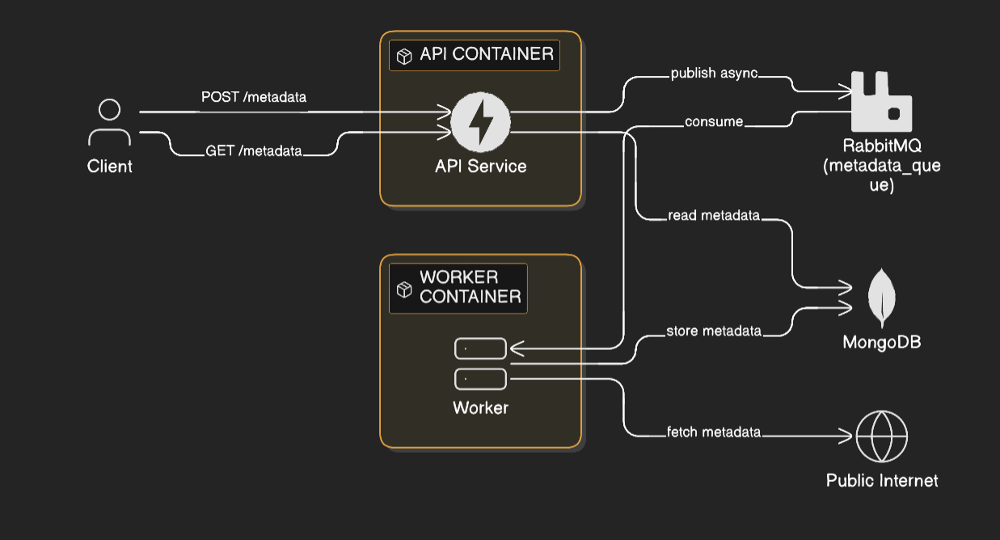

# 🏗️ High-Level Design: HTTP Inventory

This document outlines the architectural blueprint for the **HTTP Inventory** system—a distributed service designed to fetch, process, and store website metadata asynchronously.

## 1. System Architecture

The system follows a **Producer-Consumer** pattern decoupled by a message broker.

---

## 2. Core Components



### 🟢 API Service (FastAPI)

* **Role:** The entry point for external clients.
* **Ingestion:** Validates URLs and enqueues tasks. It returns `202 Accepted` immediately to remain non-blocking.
* **Retrieval:** Provides a RESTful interface to query stored metadata from MongoDB.
* **Resilience:** Implements a state-machine publisher that handles RabbitMQ reconnections and backpressure.

### ⚙️ Worker Service (Async Python)

* **Role:** The processing engine.
* **Consumption:** Pulls messages from RabbitMQ with a `prefetch_count=1` to ensure stability.
* **Execution:** Performs HTTP fetches (headers, cookies, source code), manages retry counts, and updates MongoDB.
* **Graceful Shutdown:** Handles `SIGTERM` to ensure in-flight fetches finish before the container stops.

### 🐇 RabbitMQ (Message Broker)

* **Queue:** `metadata_queue` (Durable).
* **Safety:** Uses Publisher Confirms and Persistent Delivery Mode to prevent message loss during broker restarts.
* **Backpressure:** Configured with `x-max-length=1000` and `reject-publish` to prevent memory exhaustion.

### 🍃 MongoDB (Persistence)

* **Storage:** Stores the final metadata and the current processing state of every URL.
* **Idempotency:** Uses unique indexes on the `url` field to ensure that re-delivered messages update existing records rather than creating duplicates.

---

## 3. Data Flow & State Machine

### **The "Accepted" Flow (POST)**

1. **Client** sends a URL to `/metadata`.
2. **API** validates the URL and publishes a message to **RabbitMQ**.
3. **API** returns `202 Accepted` with a `request_id`.
4. **Worker** picks up the message, fetches the site, and saves it to **Mongo**.

### **The Retrieval Flow (GET)**

* **Cache Hit:** If metadata exists and is `COMPLETED`, return `200 OK` with data.
* **In-Progress:** If the status is `PENDING` or `IN_PROGRESS`, return `202 Accepted`.
* **Cache Miss:** If the URL is unknown, the API automatically enqueues a new fetch task and returns `202 Accepted`.

---

## 4. Reliability & Recovery

| Feature | Strategy |
| --- | --- |
| **At-Least-Once** | Messages are only `ACKed` after successful DB persistence. |
| **Retry Logic** | Retryable errors (timeouts, 5xx) are requeued up to **3 times**. |
| **Fatal Errors** | Uncaught exceptions or 4xx errors mark the record as `FAILED_PERMANENT`. |
| **Connection Loss** | Both API and Worker use exponential backoff (1s → 30s) to reconnect to Mongo/RabbitMQ. |

---

## 5. Schema Overview

### **Metadata Record**

```json
{
  "url": "https://example.com",
  "status": "COMPLETED",
  "metadata": {
    "status_code": 200,
    "headers": { ... },
    "page_source": "<html>...</html>",
    "final_url": "https://example.com/"
  },
  "processing": {
    "attempt_number": 1,
    "error_msg": null,
    "last_request_id": "uuid-v4"
  },
  "updated_at": "2026-02-21T03:17:37Z"
}

```

---

## 6. Implementation Notes & Constraints

* **No Distributed Transactions:** We prioritize availability. Consistency is managed through idempotent MongoDB updates.
* **Bounded Memory:** The system will reject new requests if the queue depth exceeds 1,000 messages, protecting the infrastructure from spikes.
* **Single-Worker Focus:** While horizontally scalable, the current HLD assumes a single worker instance to maintain strict sequential processing per resource.

---