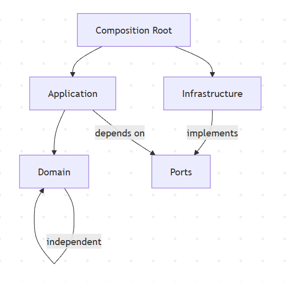

# 📈 Low-Level Design: HTTP Inventory Service

This document details the internal architecture, component interactions, and error-handling strategies for the HTTP Inventory system.

---

## 🏗️ 1. Layered Architecture (Clean Architecture)

The codebase is built on **Clean Architecture** principles, ensuring that the business logic (Domain) remains decoupled from external frameworks (Infrastructure).

### Component Diagram

### Dependency Rules

* **Domain:** Pure Python. Zero dependencies on infrastructure or frameworks.
* **Ports:** Protocol-based interfaces (ABCs) that define the "contracts" for the system.
* **Application:** Orchestrates flow; depends on Domain and Ports.
* **Infrastructure:** Concrete implementations (MongoDB, RabbitMQ, HTTPX).
* **Composition Root:** The "wiring" layer where concrete implementations are injected into services.

### 📂 Layer Mapping

#### **API Service**

| Layer | Path | Responsibility |
| --- | --- | --- |
| **Domain** | `api/app/schemas/` | Pydantic request/response models. |
| **Application** | `api/app/services/` | Logic for enqueuing metadata requests. |
| **Ports** | `api/app/ports/` | Interfaces for Publisher and Repository. |
| **Infrastructure** | `api/app/infrastructure/` | RabbitMQ and MongoDB concrete logic. |

#### **Worker Service**

| Layer | Path | Responsibility |
| --- | --- | --- |
| **Domain** | `worker/app/domain/` | Fetcher logic, Domain models, Value objects. |
| **Application** | `worker/app/application/` | The main `ProcessingService` logic. |
| **Ports** | `worker/app/ports/` | HTTP, Repository, and Consumer interfaces. |
| **Infrastructure** | `worker/app/infrastructure/` | `httpx` adapters, `motor` (Mongo) adapters. |

---

## 📨 2. Publisher Architecture (RabbitMQ)

The API uses a robust state-machine-based publisher to ensure message delivery even during intermittent network failures.

### **State Transitions**

The publisher moves through a strict lifecycle:
`DISCONNECTED` → `CONNECTING` → `CONNECTED` → `CHANNEL_OPEN` → `READY`

* **Confirm Mode:** All channels use `publisher_confirms=True`. The `publish()` method awaits a broker ACK with a timeout.
* **Resilience:** Uses an exponential backoff loop (`_reconnect_loop`) to handle broker restarts.
* **Concurrency:** An `asyncio.Lock` ensures that a reconnection doesn't tear down the channel while a message is being published.

---

## ⚙️ 3. Worker Processing Logic

The worker follows a "Fetch-Update-Ack" cycle.

### **Message Execution Flow**

1. **Acquire Lock:** Ensures the worker processes messages strictly sequentially.
2. **Ensure Record:** Upserts a `PENDING` record in MongoDB using `$setOnInsert`.
3. **Fetch:** Executes the HTTP request via `MetadataFetcher`.
4. **Handle Outcome:**
* **Success:** Truncates source if , marks `COMPLETED`, and **ACKs**.
* **Retryable Error:** (Timeout/5xx) Increments attempt count. If , **NACKs** with `requeue=True`.
* **Fatal Error:** Marks `FAILED_PERMANENT` and **ACKs** to remove from queue.

> [!IMPORTANT]
> **Retry Policy:** `MAX_RETRIES` is set to 3. Attempts are 0-indexed (0, 1, 2). Once the counter hits 3, the message is discarded to the "Permanent Failure" state.

---

## 💾 4. Persistence & Repository

The system uses **MongoDB** as its primary state store.

### **Atomic Transitions**

To prevent race conditions, all writes use idempotent operations:

* **`update_one(..., upsert=True)`**: Ensures that if a message is redelivered, we don't create duplicate entries for the same URL.
* **Read-Only API:** The API service uses a restricted `MetadataRepository` port that only allows `GET` operations, preventing accidental state corruption from the web layer.

---

## 🛡️ 5. Edge Case Handling

| Scenario | Resolution Strategy |
| --- | --- |
| **Duplicate POST** | Handled via `$setOnInsert`. The record is updated/overwritten, not duplicated. |
| **Worker Crash** | Unacked messages are redelivered by RabbitMQ. Worker resets state to `IN_PROGRESS` on restart. |
| **Queue Overflow** | Configured with `x-max-length=1000` and `reject-publish`. API returns `503 Service Unavailable`. |
| **Large Payload** | HTML content exceeding 1,000,000 characters is truncated; metadata is preserved in `additional_details`. |

---

## 🚀 6. Concurrency & Performance

* **QoS (Prefetch):** Set to `1`. The worker never "buffers" messages locally; it only takes what it is currently processing.
* **Async I/O:** The entire stack (`httpx`, `motor`, `aio-pika`) is non-blocking, allowing a single event loop to manage I/O efficiently.
* **Graceful Shutdown:** On `SIGTERM`, the worker stops accepting new messages and waits up to 60 seconds for the current in-flight fetch to complete before closing DB connections.

---

## 🔌 7. Extensibility Points

The architecture is designed to be "Pluggable":

* **Messaging:** Swap RabbitMQ for Kafka by implementing the `MessagePublisher` Protocol.
* **Database:** Swap MongoDB for PostgreSQL by implementing the `MetadataRepository` Protocol.
* **Client:** Swap `httpx` for `aiohttp` by updating the `AbstractHttpClient` adapter.

